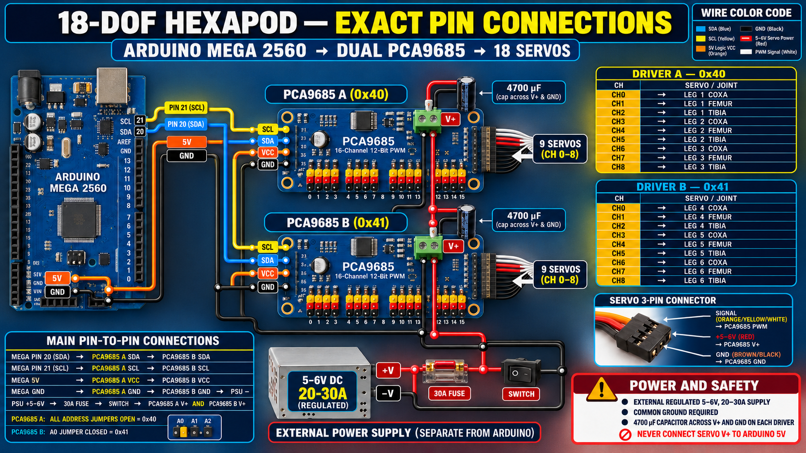

# 18-DOF Hexapod Firmware — Arduino Mega 2560

Complete, self-contained firmware for a six-legged robot with three joints per leg. It drives 18 hobby servos through two PCA9685 boards, performs three-link inverse kinematics, generates a non-blocking tripod gait, stores servo trims in EEPROM, and exposes a safe serial command interface.


## Hardware target

- Arduino Mega 2560
- PCA9685 A at I²C address `0x40`
- PCA9685 B at I²C address `0x41` (`A0` jumper closed)
- 18 positional hobby servos
- Regulated 5–6 V servo supply sized for the measured stall current; 20–30 A is a common starting range for 18 high-torque hobby servos
- 30 A fuse, master power switch, and one 4700 µF capacitor at each driver
- Optional normally-open emergency-stop switch from Mega pin 2 to GND

The PCA9685 driver is implemented inside this project. No third-party Arduino library is required; only the built-in `Wire` and `EEPROM` libraries are used.

## Critical safety rules

1. Never power the 18 servos from the Arduino 5 V pin.
2. Connect Arduino GND, both PCA9685 GND pins, and servo-supply negative together.
3. Connect Mega 5 V only to each PCA9685 `VCC` logic pin. Connect the external 5–6 V rail only to each PCA9685 `V+` servo terminal.
4. Test one unloaded joint at a time while the robot is supported above the floor.
5. Verify every servo direction and pulse limit before commanding `stand` or any gait.
6. Use a fuse, correctly rated wiring, and a supply with current limiting.

## Exact pin connections


| From              | To                                                          |
| ----------------- | ----------------------------------------------------------- |
| Mega pin 20 `SDA` | PCA9685 A `SDA`, then PCA9685 B `SDA`                       |
| Mega pin 21 `SCL` | PCA9685 A `SCL`, then PCA9685 B `SCL`                       |
| Mega `5V`         | PCA9685 A `VCC`, then PCA9685 B `VCC`                       |
| Mega `GND`        | PCA9685 A `GND`, PCA9685 B `GND`, and power-supply negative |
| Supply `+5–6V`    | 30 A fuse → switch → `V+` on both PCA9685 boards            |
| Supply negative   | Common-ground rail                                          |
| Optional E-stop   | Mega pin 2 to GND; active LOW with internal pull-up         |

Put a 4700 µF electrolytic capacitor across `V+` and `GND` near each PCA9685 servo-power terminal. Observe capacitor polarity.

## Servo channel mapping

| Leg | Joint | Driver | Address | Channel |
| --: | ----- | ------ | ------- | ------: |
|   1 | Coxa  | A      | `0x40`  |     CH0 |
|   1 | Femur | A      | `0x40`  |     CH1 |
|   1 | Tibia | A      | `0x40`  |     CH2 |
|   2 | Coxa  | A      | `0x40`  |     CH3 |
|   2 | Femur | A      | `0x40`  |     CH4 |
|   2 | Tibia | A      | `0x40`  |     CH5 |
|   3 | Coxa  | A      | `0x40`  |     CH6 |
|   3 | Femur | A      | `0x40`  |     CH7 |
|   3 | Tibia | A      | `0x40`  |     CH8 |
|   4 | Coxa  | B      | `0x41`  |     CH0 |
|   4 | Femur | B      | `0x41`  |     CH1 |
|   4 | Tibia | B      | `0x41`  |     CH2 |
|   5 | Coxa  | B      | `0x41`  |     CH3 |
|   5 | Femur | B      | `0x41`  |     CH4 |
|   5 | Tibia | B      | `0x41`  |     CH5 |
|   6 | Coxa  | B      | `0x41`  |     CH6 |
|   6 | Femur | B      | `0x41`  |     CH7 |
|   6 | Tibia | B      | `0x41`  |     CH8 |

Servo plug convention: signal (orange/yellow/white) goes to PWM, red goes to `V+`, and brown/black goes to GND. Confirm your servo manufacturer’s pinout before applying power.

## Build and upload

### Arduino IDE

1. Install the Arduino AVR Boards package.
2. Open `HexapodMega/HexapodMega.ino`.
3. Select **Arduino Mega or Mega 2560** and the correct serial port.
4. Compile and upload.
5. Open Serial Monitor at **115200 baud** with **Newline** line ending.

### PlatformIO

From the project root:

```bash
pio run
pio run -t upload
pio device monitor
```

## Safe first start

1. Leave servo power OFF and upload the firmware.
2. Run `scan`; confirm devices at `0x40` and `0x41`.
3. Support the robot so no leg carries weight.
4. Turn servo power ON and keep the master switch within reach.
5. Run `neutral`. If any joint moves toward a hard stop, immediately switch servo power off and reverse that servo’s `direction` in `ServoConfig.cpp`.
6. Mechanically fit each horn close to its neutral position.
7. Use `trim 1 coxa -3.5` style commands for fine alignment.
8. Run `save` only after every joint is verified.
9. Measure the links and edit `COXA_LENGTH_MM`, `FEMUR_LENGTH_MM`, `TIBIA_LENGTH_MM`, and `DEFAULT_REACH_MM` in `Config.h`.
10. Start with `stand`, then `forward 20`, and repeat motion commands within three seconds while testing the watchdog.

See [docs/CALIBRATION.md](docs/CALIBRATION.md) for the complete procedure.

## Serial commands

| Command                      | Purpose                                                |
| ---------------------------- | ------------------------------------------------------ |
| `help`                       | Print all commands                                     |
| `status`                     | Show motion state and gait settings                    |
| `scan`                       | Scan the I²C bus                                       |
| `neutral`                    | Command all joints to their calibration-neutral angles |
| `servo 2 femur 90`           | Move one joint manually                                |
| `trim 2 femur -4.5`          | Change one runtime trim in degrees                     |
| `save` / `load` / `defaults` | Manage EEPROM calibration                              |
| `stand` / `sit` / `relax`    | Pose or disable the robot                              |
| `walk 40 0 0`                | Forward, lateral-left, turn-left percentages           |
| `forward 30`, `back 30`      | Walk forward or backward                               |
| `left 30`, `right 30`        | Strafe                                                 |
| `turnl 30`, `turnr 30`       | Turn in place                                          |
| `stop`                       | Return to neutral standing pose                        |
| `speed 50`                   | Gait rate, 10–100%                                     |
| `stride 55`                  | Stride length in mm                                    |
| `step 35`                    | Foot lift in mm                                        |
| `body 95`                    | Standing body height in mm                             |
| `estop` / `clear`            | Latch or clear the software emergency stop             |

Motion commands time out after three seconds by default. Change `MOTION_COMMAND_TIMEOUT_MS` in `Config.h` only after you understand the safety consequence.

## Coordinate and leg conventions

- Body frame: `+X` forward, `+Y` left, `+Z` upward.
- Local leg frame used by IK: `+X` outward, `+Y` tangential, and negative `Z` below the hip.
- Leg 1: front-left
- Leg 2: middle-left
- Leg 3: rear-left
- Leg 4: front-right
- Leg 5: middle-right
- Leg 6: rear-right
- Tripod A: legs 1, 3, and 5
- Tripod B: legs 2, 4, and 6

## Project structure

```text
HexapodMega/
  HexapodMega.ino       startup, watchdog, E-stop, main loop
  PCA9685Driver.*       self-contained low-level PWM driver
  Kinematics.*          analytical 3-DOF leg IK
  HexapodController.*   servo mapping, limits, trims, interpolation
  GaitEngine.*          non-blocking tripod gait
  CommandProcessor.*    fixed-buffer serial command interface
  ConfigStore.*         checksummed EEPROM calibration
  Config.h              geometry and system configuration
  ServoConfig.*         channel, direction, pulse and neutral settings
docs/                   wiring, calibration, command and architecture notes
tests/host/              desktop compile and math smoke-test harness
```

## Important configuration note

No generic firmware can know the exact horn alignment, servo direction, pulse range, or link dimensions of a physical robot. The supplied defaults are deliberately conservative starting values, not a guarantee for a particular chassis. Complete the calibration procedure before loading the legs.

## License

MIT License. See `LICENSE`.

## Validation

The desktop harness compiles every firmware translation unit with strict warnings and runs nominal/unreachable IK plus EEPROM round-trip smoke tests. On Linux or macOS with `g++` installed, run:

```bash
./tests/run_host_tests.sh
```

Hardware-in-the-loop testing is still required because servo orientation, loading, pulse limits, and link geometry depend on the physical build.
